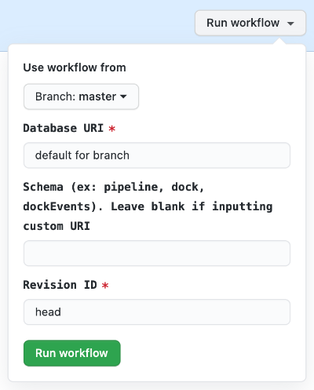

# Alembic Migrations

## How to use
1. Navigate to the Actions tab of the database_models repo [here](https://github.com/strongarm-tech/database_models/actions).
2. Under All workflows, select Alembic Migrations, and click the Run workflow dropdown.
3. In the first input, specify the appropriate database URI.  Refer to this [page](https://strongarm.atlassian.net/wiki/spaces/SPD/pages/1435369487/Segregated+Databases) for details.
4. In the second input, specify the alembic revision ID you would like the database to have at completion.
5. Click Run workflow

