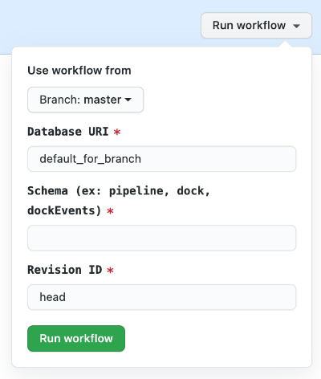

# Alembic Migrations

## How to use
1. Navigate to the Actions tab of the database_models repo [here](https://github.com/strongarm-tech/database_models/actions).
2. Under All workflows, select Alembic Migrations, and click the Run workflow dropdown.
3. In the first input, specify the appropriate database URI only if it differs from the default for that branch.  Otherwise, leave as `default_for_branch`.  Refer to this [page](https://strongarm.atlassian.net/wiki/spaces/SPD/pages/1435369487/Segregated+Databases) for details.
4. In the second input, specify the schema you are modifying.
5. In the third input, specify the alembic revision ID you would like the database to have at completion.
6. Click Run workflow

## Screenshot

## Notes
1. By default, selecting a branch will automatically determine the appropriate subaccount to run the migrations against.  Explicitly setting a database URI will override this default
2. By default, the Revision ID is set to head, meaning that alembic should upgrade to the latest revision.
3. The underlying Python script attempts to find out which alembic revision ID the database is currently at and, using the provided target Revision ID, will determine if an upgrade or downgrade is necessary.  It will then implement that change.

## Common Errors
1. ### `Database URI is invalid`

   The Database URI did not have all the necessary parts and is therefore invalid.

2. ### `Unknown database "<schema>"`

   The schema entered, either explicitly or as part of the database URI, is not recognized

3. ### `"<REVISION ID>" is not a vaild revision ID`

   The revision ID specified could not be found.  You can see all revision ID's by running `alembic history` from the command line.  This can also happen if the revision has not been committed and pushed up to the branch yet.

4. ### `Current revision ID "<REVISION ID>" not contained in history`

   The revision ID currently in the database does not match any of the revision ID's found in the versions subfolder.  You can see all revision ID's by running `alembic history` from the command line.

## References
* [Alembic Tutorial](https://alembic.sqlalchemy.org/en/latest/tutorial.html)
